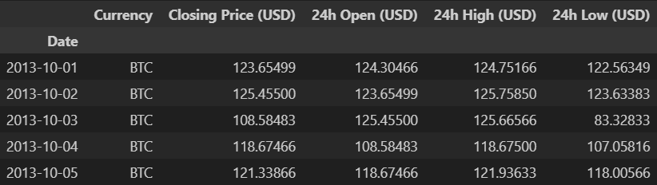

# BTC prediction

This project is a time series prediction for bitcoin price. I have developed a base model (Naive forecast) and evaluated it. Then I have tried  a dense model with window size = 7 that predicts the next day price (horizon=1). I have developed several other models including CNN and N-BEATS models and tuned the hyperparameters for N-BEATS algorithm. Then, I tried an ensemble model and encountered the turkey problem. Finally, I have compared these models based on performance with regards to mean absolute error (MAE), mean squared error (MSE), root mean squared error (RMSE), mean absolute percentage error (MAPE) and mean absolute scaled error (MASE). You can see a list of models that are tested below:

1. **Model 0: Naïve forecast (baseline)**
2. **Model 1: Dense model (window = 7, horizon = 1)**
3. **Model 2: Dense (window = 30, horizon = 1)**
4. **Model 3: Dense (window = 30, horizon = 7)**
5. **Model 4: Conv1D**
6. **Model 5: RNN (LSTM)**
7. **Model 6: Dense (multivariate time series)**
8. **Model 7: N-BEATS algorithm**
9. **Model 8: Creating an ensemble (stacking different models together using different loss functions)**
10. **Model 9: Train a model on the full historical data to make predictions into future**
11. **Model 10: Why forecasting is not good (the turkey problem)**

## Data

The bitcoin historical timeseries data is downloaded in the notebook automatically. This data contains OHLC (open, high, low, close) data for daily bitcoin charts. The data will be automatically downloaded while the notebook is running. You can see sample timeseries data here:



I have drawn a chart based on the data as well.


The bitcoin timeseries has been split in a way that prevents data leakage. data has been split based on their date and time.


The data has been labelled in windows so that each window has a label for the horizon of prediction and our models other than model 0 can work with it. For example, window size = 7 and horizon = 1 means that the model uses previous week data to predict the next day price of bitcoin.


Then, I have made a multivariate time series using block reward values and block reward dates.


Some data has been added manually to simulate the Turkey problem in forecasting the price of bitcoin.


## N-BEATS algorithm

[N-BEATS](https://arxiv.org/abs/1905.10437) algorithm focuses on solving the univariate times series point forecasting problem using backward and forward residual links and a deep stack of fully-connected layers.

## N-BEATS hyperparameters

Values are driven from N-BEATS paper Figure 1 and Table 18/Appendix D.

- N_EPOCHS = 5000 # called "Iterations" in Table 18
- N_NEURONS = 512 # called "Width" in Table 18
- N_LAYERS = 4
- N_STACKS = 30

- INPUT_SIZE = WINDOW_SIZE * HORIZON # called "Lookback" in Table 18
- THETA_SIZE = INPUT_SIZE + HORIZON

- INPUT_SIZE, THETA_SIZE

## Installation

You can install the required libraries by the command below:

```bash
pip install -r requirements.txt
```

## Run

You can run the notebook on Colab, Kaggle or jupyter notebook.

Clone the project

```bash
  git clone https://github.com/MrAliAmani/BTC-prediction
```

## Results

Naive model is selected as the baseline to improve upon it. You can see its forecasts below:


Another plot shows its forecasts on test data.


Here are the predictions of models 1, 2 and 3:


Here is the comparison of models 0, 1, 2 and 3 based on MAE score that shows different windows and horizons.


I have plotted the prediction intervals (uncertainty estimates) of model 8 (the ensemble model). There are two types of uncertainty (coconut and subway):

1. Aleatoric uncertainty - this type of uncertainty cannot be reduced, it is also referred to as "data" or "subway" uncertainty.

2. Epistemic uncertainty - this type of uncertainty can be reduced, it is also referred to as "model" or "coconut" uncertainty, it is very hard to calculate.


This image shows the prediction on 14 days of bitcoin prices


Model 10 shows the Turkey problem to our BTC data (price of BTC falls 100x in one day).


This plot shows model performance comparison on MAE score.


## Lessons Learned

- Using multivariate timeseries data can improve the prediction performance. This data can be engineered based on timeseries features and external data like bitcoin halvings.

- N-BEATS algorithms shows good performance on timeseries forecasting by using backward and forward residual links in a deep stack of dense layers.

- Turkey problem can affect model's performance when the price has rapid changes.

## Papers

**[N-BEATS: Neural basis expansion analysis for interpretable time series forecasting](https://arxiv.org/abs/1905.10437)** paper from Boris N. Oreshkin et al. Its architecture is shown in the figure below:


## License

This project is under MIT license:

[](https://choosealicense.com/licenses/mit/)

## Feedback

If you have any feedback, please reach out to me at *<aliamani019@gmail.com>*.

## Authors

[@AliAmani](https://github.com/MrAliAmani)
